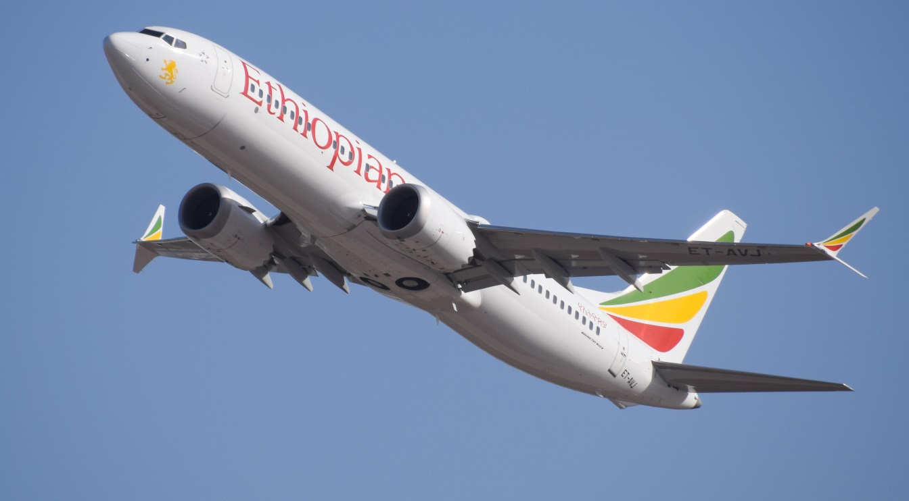

# Downed 737 Max 8s Lacked Safety Features Boeing Only Sells as Extras

One of the major questions raised concerning Boeing’s 737 Max 8 is whether the MCAS (Maneuvering Characteristics Augmentation System) hardware installed on the plane to help prevent aircraft stalls could have malfunctioned and contributed to the loss of both Lion Air 610 last year and Ethiopian Airlines Flight 302 more recently. While that investigation is ongoing, new information indicates that Boeing sells upgrades to critical flight systems that might have improved their overall safety — but it sells them as value-added profit centers in much the same way you might add a stereo option to a car.

> ET-AVJ, the aircraft destroyed in the crash of Flight 302.

Boeing sells two MCAS upgrades that weren’t installed on either the Lion Air jet or the Ethiopian Airlines craft, according to the New York Times. The first is the ability to compare data from more than one AOA sensor via a display that would have shown readings from both at the same time. The second was a ‘disagree light’ that would have activated when contradictory data was being received from both sensors. Either might have alerted the pilots that something was wrong with the MCAS system specifically.

Boeing now states it will make the disagree light standard on all 737 Max 8 aircraft, in addition to the planned software updates it will roll out next month. This new information answers questions some of our readers had raised regarding the capabilities of the MCAS with regard to AOA sensors. When initially rolled out, the MCAS only relied on data from a single AOA sensor. There are multiple AOA sensors in a 737 Max 8, including sensors on both sides of the aircraft. After the upcoming April software update, the MCAS will be updated to check both sensors and to disable itself if there is “meaningful disagreement” between the two.

The fact that safety equipment that could have prevented the 737 Max 8 crash was left optional and uninstalled will undoubtedly figure prominently in the investigation into how Boeing could have allowed this to happen in the first place. Some FAA employees have stated they faced intra-agency pressure to provide a friendly regulatory environment for Boeing and to speed approval of the 737 Max 8, including allowing Boeing to self-certify its own safety systems. Some of these changes were put in place in the aftermath of 9/11, but the pressure to get the 737 Max 8 to market in order to compete with the Airbus 320neo was reportedly quite high.

The NYT details how money-making add-ons are a major profit center for airlines. Boeing is known to charge extra for an additional fire extinguisher system in the hold. Japanese regulators require such systems; the FAA does not, despite evidence that a single extinguisher may not be enough to put out fires. Boeing refused to provide a menu of the safety options it sells on aircraft or their prices, but the paper states that such options typically add $800,000 to $2M to the price of an aircraft, representing roughly 5 percent of the total cost of the plane.

It isn’t unusual to see vehicle manufacturers add safety features as extras, either, but the fact that Boeing has lost two brand-new aircraft — and the radically different safety standards used in the airline industry as opposed to the automotive market — are going to shine a harsh light on the company’s practices in this area.

Feature image by Wikipedia: <https://zh.wikipedia.org/wiki/%E6%B3%A2%E9%9F%B3737_MAX>

相关链接:

- <https://www.extremetech.com/extreme/287856-ethiopian-airlines-black-box-data-retrieved-shows-similarities-to-lion-air-crash>
- <https://www.extremetech.com/extreme/287672-trump-grounds-all-737-max-flights-after-ethiopian-airlines-disaster>
- <https://www.extremetech.com/extreme/280521-boeing-737-crash-caused-by-new-safety-system-pilots-werent-told-existed>

原文链接: <https://www.extremetech.com/extreme/288099-downed-787-max-8s-lacked-safety-features-boeing-only-sells-as-extras?utm_source=edit&utm_medium=notification>

原文日期: March 21, 2019 at 12:49 pm

