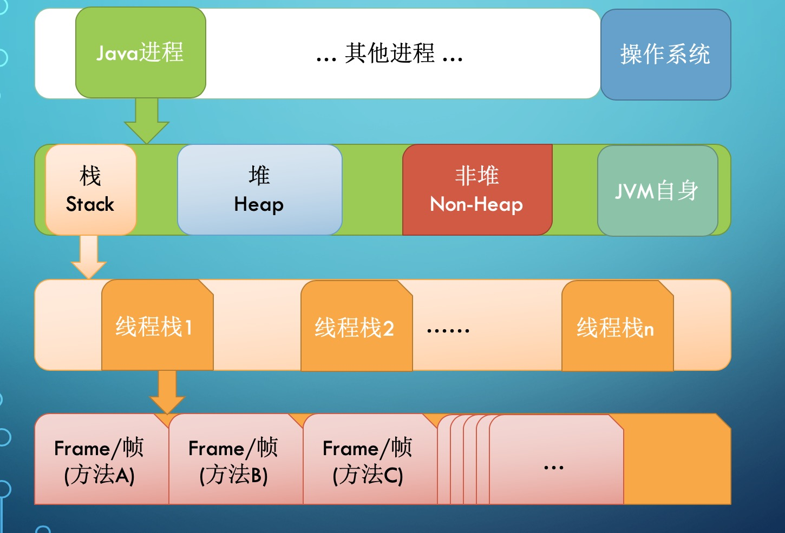
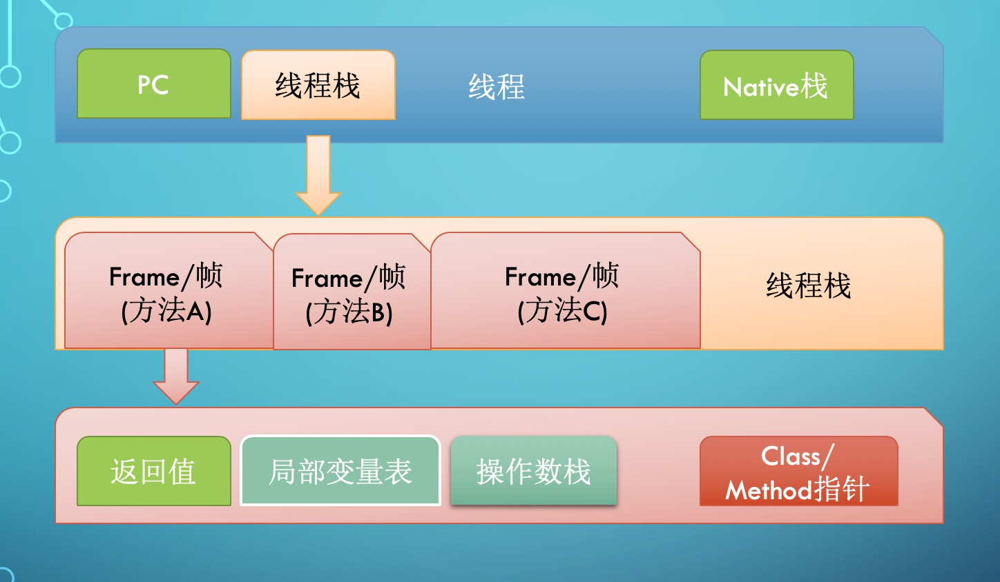
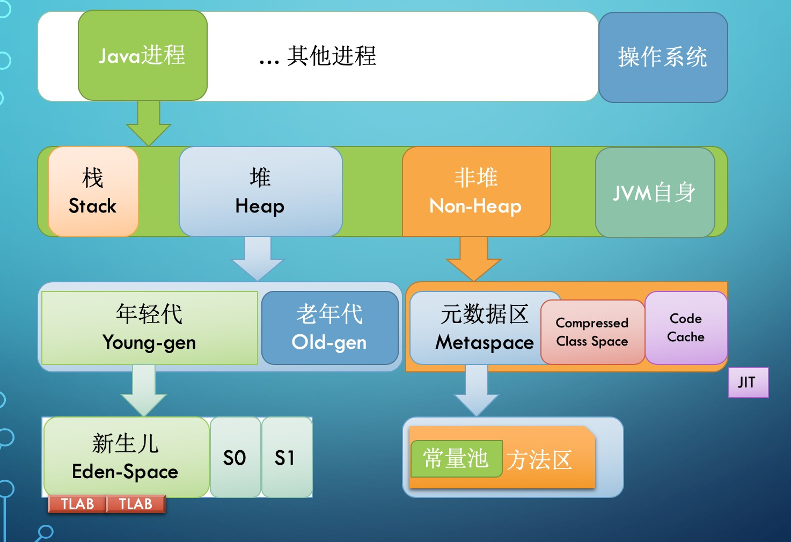

# 标题

1.题目: JVM问题诊断快速入门

2.作者简介: 任富飞，资深Java工程师，具有8年软件设计和开发经验，3年调优经验。
翻译爱好者, 热爱各种开源技术，对JVM和Java体系有较深入的理解，熟悉互联网领域常用的各种调优套路。

3.内容介绍:

本次分享主要介绍如何进行JVM问题诊断，在排查过程中可以使用哪些工具, 通过示例对各种工具进行简单的讲解,
并引入相关的基础知识，在此过程中，结合作者的经验和学到的知识，提出一些观点和调优建议。
内容涉及：

1. 环境准备与相关设置

2. 常用性能指标介绍

3. JVM基础知识和启动参数

4. JDK内置工具介绍和使用示例

5. JDWP简介

6. JMX与相关工具

7. 各种GC日志解读与分析

8. 内存dump和内存分析工具介绍

9. 面临复杂问题时可选的高级工具

10. 应对容器时代面临的挑战

# 正文


JVM全称为 Java Virtual Machine, 翻译为中文 "Java虚拟机"。

文中的JVM主要指 Oracle 公司的 HotSpot VM, 版本是Java8(JDK8,JDK1.8是同样的版本)。

关于JVM的文章，书籍有很多。 有基础的，也有深入的。

本文主要介绍各种简单工具的使用，穿插一些基本的知识点。 目的是为了让初学者快速上手，先入个门。

入门的意思，按我的理解就是： 会描述问题，知道怎么去搜索，怎么去找路子深入学习。


## 1. 环境准备与相关设置


### 1.1 安装JDK，以及设置环境变量.

JDK通常是从 [Oracle官网](https://www.oracle.com/)下载， 打开页面翻到底部，找 `Java for Developers`, 下载对应的x64版本即可。

> 现在流行将下载链接放到页面底部，很多工具都这样。当前推荐下载 JDK8。 今后JDK11可能成为主流版本，因为Java11是LTS长期支持版本，但可能还需要一些年才会普及，而且两个版本的结构不太兼容。

有的操作系统提供了自动安装工具，直接使用也可以，比如 yum, brew, apt 等等。这部分比较基础，有问题直接搜索即可。

安装完成后，Java环境一般来说就可以使用了。 验证的脚本命令为:

```shell
javac -version
java -version
```

如果找不到命令，需要设置环境变量： `JAVA_HOME`  和  `PATH` 。

>  `JAVA_HOME`  环境变量表示JDK的安装目录，通过修改 `JAVA_HOME` ，可以快速切换JDK版本 。很多工具依赖此环境变量。
>
> 另外, 建议不要设置 `CLASS_PATH` 环境变量，新手没必要设置，容易造成一些困扰。

Windows系统,  系统属性 - 高级 - 设置系统环境变量。 如果没权限也可以设置用户环境变量。

Linux和MacOSX系统, 需要配置脚本。 例如:

```shell
cat ~/.bash_profile

# JAVA ENV
export JAVA_HOME=/Library/Java/JavaVirtualMachines/jdk1.8.0_162.jdk/Contents/Home
export PATH=$PATH:$JAVA_HOME/bin
```

让环境配置立即生效:

```shell
source ~/.bash_profile
```

查看环境变量:

```shell
export
echo $PATH
echo $JAVA_HOME
```

一般来说，`.bash_profile` 之类的脚本只用于设置环境变量。 不设置随机器自启动的程序。

如果不知道自动安装/别人安装的JDK在哪个目录怎么办?

> 最简单/最麻烦的查询方式是询问相关人员。

查找的方式很多，比如，可以使用 `which`， `whereis`， `ls -l` 跟踪软连接, 或者 `find` 命令全局查找(可能需要sudo权限), 例如:

```shell
jps -v
whereis javac
ls -l /usr/bin/javac
find / -name javac
```

找到满足  `$JAVA_HOME/bin/javac`  的路径即可。

WIndows系统，安装在哪就是哪，通过任务管理器也可以查看某个程序的路径，注意 `JAVA_HOME` 不可能是 `C:/Windows/System32` 目录。


### 1.2 其他准备工作

按照官方文档的说法，在诊断问题之前，可以做这些准备：

- 取消core文件限制

  `ulimit -c unlimited` , 这属于高级操作，可以使用 `kill -6 <pid>` 杀进程来生成core文件, 然后用 `gdb` 或者其他工具进行调试。 本文不介绍，只是列出这个知识点。

- 开启自动内存Dump选项

  增加启动参数 `-XX:+HeapDumpOnOutOfMemoryError`, 在内存溢出时自动转储，下文会进行介绍。

- 可以生成 JFR 记录

  这是JDK内置工具 jmc 提供的功能, Oracle 试图用jmc来取代 JVisualVM。而且在商业环境使用JFR需要付费授权，我认为这是个鸡肋功能，如果想学习也可以试试。

- 开启GC日志

  这是标配。比如设置 `-verbose:gc` 等选项，请参考下文。

- 确定JVM版本以及启动参数

  有多种手段获取, 最简单的是 `java -version`，但某些环境下有多个JDK版本，请参考下文。

- 允许 JMX 监控信息

  JMX支持远程监控，通过设置属性来启用，请参考下文。


## 2. 常用性能指标介绍


JVM诊断是要诊断些什么呢?

- 1. 程序BUG: 程序问题必须是优先解决的，要保证正确性。例如死锁等等, 当然，JVM层面的排查只是辅助手段，更多的还是分析业务代码和逻辑确定Java程序哪里有问题。
- 2. 系统性能问题: 比如借助监控和日志，判断资源层面有没有问题? JVM层面有没有问题?


进行JVM问题诊断的目的有：

- 排查程序运行中出现的问题
- 优化性能
- 学习研究和知识储备

计算机系统中,性能相关的资源主要分为这几类:

- CPU
- 内存
- IO: 存储+网络


性能优化中常见的套路：

一般先排查基础资源是否成为瓶颈。看资源够不够，只要成本允许，加配置可能是最快速的解决方案，还可能是最划算，最有效的解决方案。

与JVM有关的系统资源，主要是 `CPU` 和 `内存` 这两部分。 如果发生资源告警/不足, 就需要评估系统容量，分析原因。

> 至于 GPU 、主板、芯片组之类的资源则不太好衡量，通用计算系统很少涉及。


一般衡量系统性能的维度有3个:

- 延迟(Latency), 一般衡量的是响应时间(Response Time)，比如95线，99线，最大响应时间等。
- 吞吐量(Throughput), 一般的衡量每秒处理的事务数(TPS)。
- 系统容量(Capacity), 也叫做设计容量，可以理解为硬件配置，成本约束。

这3个维度互相关联，相互制约。只要系统架构允许，增加硬件配置一般都能提升性能指标。


性能指标还可分为两类:

- **业务需求指标**：如吞吐量(QPS、TPS)、响应时间(RT)、并发数、业务成功率等。
- **资源约束指标**：如CPU、内存、I/O等资源的消耗情况

> 详情可参考: [性能测试中服务器关键性能指标浅析](https://www.jianshu.com/p/62cf2690e6eb)


每类系统关注的重点还不一样。 批处理/流处理 系统更关注吞吐量, 延迟可以适当放宽。一般来说大部分系统的硬件资源不会太差，但也不是无限的。高可用Web系统，既关注高并发情况下的系统响应时间，也关注吞吐量。


> **例如**： "配置2核4GB的节点，每秒响应200个请求，95%线是20ms，最大响应时间40ms。"
> 从中可以解读出基本的性能信息: 响应时间(RS<40ms), 吞吐量(200TPS), 系统配置信息(2C4G)。
> 隐含的条件可能是 "并发请求数不超过200 "。


我们可采用的方式:

- 本地/远程调试, 下文将简单介绍JDWP与远程调试。
- 状态监控
- 性能分析: CPU使用情况/内存分配分析
- 内存分析: Dump分析/GC日志分析
- JVM启动参数调整


### 怎样才算入门?

- 掌握基本的JVM基础知识, 内存划分, 常用参数配置

- 会使用工具, 看懂日志，监控, 判断各种指标是否正常

- 会搜索问题，能大致确定是什么问题，搜索/咨询解决方案, 或者自己搞定


不入门就是门外汉，门外汉就是只知道这里有一个庞然大物，云里雾里，不了解里面有什么, 需要注意些什么。

只要工具用好了，获取到相关的状态信息，并能简单分析，那么JVM诊断这个技能就算是入门了，

本文从侧面切入，讲解如何对JVM进行问题诊断。 通过监控和分析，能够判断出发生的问题是不是JVM的锅。


## 3. JVM基础知识和启动参数


Java体系中有很多规范， 其中最基本的是 [`Java语言规范` 和 `Java虚拟机规范`](https://docs.oracle.com/javase/specs/index.html)

> 各个领域的神级人物，一般都通读和掌握相关规范。


### 3.1 JVM背景知识

JVM是Java程序的底层执行环境，主要用C++语言开发，如果想深入探索JVM，那么就需要掌握一定的C++语言知识，至少也应该看得懂C++代码。

JVM的操作对象是class文件，而不是java源码。

看起来很难的样子。 就像很多神书一样，讲JVM开篇就讲怎么编译JVM。讲JMM一来就引入CPU寄存器怎么同步。

当然，不需要很深的技术栈，也是可以排查JVM问题的。


> 题外话: 目前，最多的Java虚拟机实例位于Android设备中，绝大部分的Linux系统也运行在Android设备上。
>
> 在前些年，由于存储的限制，软件安装包的大小很受关注。Java安装包分为2种类型： JDK是完全版安装包， JRE是阉割版安装包。
>
> 如今Java语言的主要应用领域是企业环境，所以Oracle在JRE的基础上，增加一部分JDK内置的工具，组合成Server JRE 版，但实际上这增加了选择的复杂度，有点鸡肋。实际使用时直接安装JDK即可。


先来看看需要具备哪些基础知识，有相关基础的读者大致过一眼即可。


### 3.2 JVM内存结构

根据对JVM内存划分的理解，制作了几张逻辑概念图。大家可以参考一下。

先看看栈内存(Stack)的大体结构：



每启动一个线程，JVM就会在栈空间栈分配对应的 **线程栈**, 比如 1MB 的空间（`-Xss1m`）。

线程栈也叫做Java方法栈。 如果使用了JNI方法，则会分配一个单独的本地方法栈(Native Stack).


线程执行过程中，一般会有多个方法组成调用栈(Stack Trace), 比如A调用B，B调用C。。。每执行到一个方法，就会创建对应的 **栈帧**(Frame).



栈帧只是一个逻辑上的概念，具体的大小，在一个方法编写完成后基本上就能确定。

比如返回值需要有一个空间存放吧，每个局部变量都需要对应的地址空间，此外还有操作数栈，以及方法指针(标识这个栈帧对应的是哪个类的哪个方法,指向常量池中的字符串常量）。


Java程序除了栈内存之外，最主要内存区域就是堆内存了。



堆内存是所有线程共用的内存空间，理论上大家都可以访问里面的内容。

但JVM的具体实现一般会有各种优化。

比如将逻辑上的Java堆,划分为堆(Heap)和非堆(Non-Heap)两个部分.  这种划分的依据在于，我们编写的Java代码，基本上只能使用Heap这部分空间，发生内存分配和回收的主要区域也在这部分，所以有一种说法，这里的Heap也叫GC管理的堆(GC Heap)。

GC理论中有一个重要的思想，叫做分代。 经过研究发现，程序中分配的对象，要么用过就扔，要么就能存活很久很久。

JVM将Heap内存分为年轻代（Young generation）和老年代（Old generation, 也叫 Tenured）两部分。

年轻代还划分为3个内存池，新生代(Eden space)和存活区(Survivor space), 存活区在大部分GC算法中有2个(S0, S1)，S0和S1总有一个是空的,但一般较小，也不浪费多少空间。

具体实现对新生代还有优化，那就是TLAB(Thread Local Allocation Buffer), 给每个线程先划定一小片空间，你创建的对象先在这里分配，满了再换。这能极大降低并发资源锁定的开销。


Non-Heap本质上还是Heap，只是一般不归GC管理，里面划分为3个内存池。

- Metaspace, 以前叫持久代(永久代, Permanent generation), Java8换了个名字叫 Metaspace.
  Java8将方法区移动到了Meta区里面，而方法又是class的一部分。。。和CCS交叉了?
- CCS, Compressed Class Space, 存放class信息的，和 Metaspace 有交叉。
- Code Cache, 存放 JIT 编译器编译后的本地机器代码。


JVM的内存结构大致如此。

还可以参考 [Metaspace解密](http://lovestblog.cn/blog/2016/10/29/metaspace/)


### 3.3 JVM启动参数


启动Java程序的格式为:

```shell
java [options] classname [args]

java [options] -jar filename [args]
```

其中:

- `[options]` 部分称为 "JVM选项",对应IDE中的 VM options, 可用 `jps -v` 查看。
-  `[args]` 部分是指 "传给main函数的参数", 对应IDE中的 Program arguments, 可用 `jps -m` 查看。

Java和JDK内置的工具，指定参数时都是一个 `-`，不管是长参数还是短参数。


有时候，JVM启动参数和Java程序启动参数，并没必要严格区分，大致知道都是一个概念即可。

JVM的启动参数, 从形式上可以简单分为：

`-???` 标准选项, java中各种参数都是一个横线 `-` 开头, 很少有两个横线 `--`;
`-X`  非标准选项， 基本都是传给JVM的。
`-XX:` 高级扩展选项, 专门用于控制JVM的行为。
  * `-XX:+-Flags` 形式, `+-` 是对布尔值进行开关。
  * `-XX:key=value` 形式, 指定某个选项的值。


#### 3.3.1 设置系统属性

使用 `-Dproperty=value` 这种形式。

例如指定随机数熵源(Entropy Source), 示例:

```shell
JAVA_OPTS="-Djava.security.egd=file:/dev/./urandom"
```


#### 3.3.2 agent相关的选项:

agent是JVM中的一项黑科技, 可以通过无侵入方式来做很多事情，比如注入AOP代码，执行统计等等，权限非常大。

设置 agent 的语法如下:

- `-agentlib:libname[=options]`  启用native方式的agent, 参考 `LD_LIBRARY_PATH` 路径。
- `-agentpath:pathname[=options]` 启用native方式的agent
- `-javaagent:jarpath[=options]` 启用外部的agent库, 比如 `pinpoint.jar` 等等。
- `-Xnoagent` 则是禁用所有 agent。

示例, 开启CPU使用时间抽样分析:

```shell
JAVA_OPTS="-agentlib:hprof=cpu=samples,file=cpu.samples.log"
```

hprof是JDK内置的一个性能分析器。`cpu=samples` 会抽样在各个方法消耗的时间占比, Java进程退出后会输出到文件。


#### 3.3.3 JVM运行模式:

`-server` 指定服务器模式, 64位JDK只支持该选项，是否设置都是这个值。

JDK1.7 之前x86.32位的默认值是 `-client` 选项, 主要原因是以前JIT编译器占内存，可能还有点慢。

示例:

```shell
JAVA_OPTS="-server"
```


#### 3.3.4 设置堆内存

JVM总内存=堆+栈+非堆+堆外内存。。。

参数:

- `-Xmx`, 指定最大堆内存。 如 `-Xmx4g`. 这只是指定了 Heap 部分的最大值为4g。
- `-Xms`, 指定堆内存空间的起始值。 如 `-Xms4g`。 并不是操作系统实际分配的初始值，而是GC先规划好，用到才分配。
  专用服务器上让 `-Xms`和`-Xmx`一致, GC日志会比较好看，不然刚启动可能就有好几个FullGCC。
  据说不一致时，堆内存扩容会有性能抖动。
- `-Xmn`, 等价于 `-XX:NewSize`, 使用G1垃圾收集器 **不应该** 设置该选项，在某些业务场景下可以设置。官方建议设置为 `-Xmx` 的 `1/2 ~ 1/4`.
- `-XX:MaxPermSize=size`, 这是JDK1.7之前使用的。Java8默认允许的Meta空间无限大。
- `-XX:MaxMetaspaceSize=size`,  Java8默认不限制Meta空间, 一般不允许设置该选项。

示例:

```shell
JAVA_OPTS="-Xms28g -Xmx28g"
```


#### 3.3.5 设置栈内存

- `-Xss`, 设置每个线程栈的字节数。 例如 `-Xss1m` 指定线程栈为1MB。
- `-XX:ThreadStackSize=1m`, 和 `-Xss1m` 等价

示例:

```shell
JAVA_OPTS="-Xss1m"
```


#### 3.3.6 GC相关


- `-verbose:gc` 参数

和其他GC参数组合使用, 在GC日志中输出详细的GC信息。 包括每次GC前后各个内存池的大小，堆内存的大小，提升到老年代的大小，以及消耗的时间。

此参数支持在运行过程中动态开关。比如使用 jcmd, jinfo， 以及使用JMX技术的其他客户端。


- `-XX:+PrintGCDetails` 和 `-XX:+PrintGCTimeStamps`, 打印GC细节与发生时间。参考GC部分。


示例:

```shell
export JAVA_OPTS="-Xms28g -Xmx28g -Xss1m \
-verbosegc -XX:+UseG1GC -XX:MaxGCPauseMillis=200 \
-XX:+HeapDumpOnOutOfMemoryError -XX:HeapDumpPath=/usr/local/"

```


#### 3.3.7 指定垃圾收集器

指定具体的垃圾收集器。

- `-XX:+UseG1GC`
- `-XX:+UseConcMarkSweepGC`
- `-XX:+UseSerialGC`
- `-XX:+UseParallelGC`


#### 3.3.8 特殊情况执行脚本


- `-XX:+-HeapDumpOnOutOfMemoryError` 选项, 当 `OutOfMemoryError` 产生，即内存溢出(堆内存或持久代)时，自动Dump堆内存。
  因为在运行时并没有什么开销, 所以在生产机器上是可以使用的。
  示例用法: `java -XX:+HeapDumpOnOutOfMemoryError -Xmx256m ConsumeHeap`

```
java.lang.OutOfMemoryError: Java heap space
Dumping heap to java_pid2262.hprof ...
......
```

- `-XX:HeapDumpPath` 选项, 与`HeapDumpOnOutOfMemoryError`搭配使用, 指定内存溢出时Dump文件的目录。
  如果没有指定则默认为启动Java程序的工作目录。
  示例用法: `java -XX:+HeapDumpOnOutOfMemoryError -XX:HeapDumpPath=/usr/local/ ConsumeHeap`
  自动Dump的hprof文件会存储到 `/usr/local/` 目录下。

- `-XX:OnError` 选项, 发生致命错误时(fatal error)执行的脚本。
  例如, 写一个脚本来记录出错时间, 执行一些命令, 或者 curl 一下某个在线报警的url.
  示例用法: `java -XX:OnError="gdb - %p" MyApp`
  可以发现有一个 `%p` 的格式化字符串，表示进程PID。

- `-XX:OnOutOfMemoryError` 选项,  抛出 OutOfMemoryError 错误时执行的脚本。

- `-XX:ErrorFile=filename` 选项, 致命错误的日志文件名,绝对路径或者相对路径。


## 4. JDK内置工具介绍和使用示例

本节介绍JDK内置的各种工具, 包括

- 命令行工具
- GUI工具
- 服务端工具

很多情况下, JVM运行环境中并没有趁手的工具， 这时候可以先用命令行工具快速查看JVM实例的基本情况。

> MacOSX，Windows系统的某些账户权限不够，有些工具可能会报错/失败，假如出问题了请排除这个因素。

下面先介绍命令行工具。

### 4.1 `jps` 工具简介

我们知道，操作系统提供一个工具叫做 `ps`, 用于显示进程状态(process status)。

Java也提供了类似的命令行工具，叫做 `jps`,  用于展示java进程信息(列表)。

需要注意的是, jps展示的是当前用户可看见的Java进程，如果看不见可能需要 `sudo`， `su` 之类的命令辅助。

查看帮助信息:

```shell
jps -help

usage: jps [-help]
       jps [-q] [-mlvV] [<hostid>]

Definitions:
    <hostid>:      <hostname>[:<port>]
```

可以看到， 这些参数分为了多个组， `-help`，`-q`，`-mlvV`， 同一组可以共用一个 `-`。

常用的参数是小写的 `-v`,  显示传递给JVM的启动参数.

```
jps -v

15883 Jps -Dapplication.home=/usr/local/jdk1.8.0_74 -Xms8m
6446 Jstatd -Dapplication.home=/usr/local/jdk1.8.0_74 -Xms8m
        -Djava.security.policy=/etc/java/jstatd.all.policy
32383 Bootstrap -Xmx4096m -XX:+UseG1GC -verbose:gc
        -XX:+PrintGCDateStamps -XX:+PrintGCDetails -Xloggc:/xxx-tomcat/logs/gc.log
        -Dcatalina.base=/xxx-tomcat -Dcatalina.home=/data/tomcat
```

看看输出的内容，其中最重要的信息是前面的进程ID(PID),

其他参数不太常用:

- `-q`  只显示进程号。
- `-m`  显示传给 main 方法的参数信息
- `-l`  显示启动 class 的完整类名, 或者启动 jar 的完整路径
- `-V`  大写的V，这个参数有问题, 相当于没传一样。官方说的跟 `-q` 差不多。

- `<hostid>` 部分是远程主机的标识符，需要远程主机启动 `jstatd` 服务器, 一般不怎么使用。

  可以看到, 格式为 `<hostname>[:<port>]`, 不能用IP, 示例: `jps -v sample.com:1099`。

知道JVM进程的PID之后，就可以使用其他工具来进行诊断了。


### 4.2 `jstat` 工具简介

`jstat` 用来监控JVM内置的各种统计信息，主要是内存和GC相关的信息。

查看 `jstat` 的帮助信息, 大致如下:

```
jstat -help
Usage: jstat -help|-options
       jstat -<option> [-t] [-h<lines>] <vmid> [<interval> [<count>]]

Definitions:
  <option>      可用的选项, 查看详情请使用 -options
  <vmid>        虚拟机标识符. 格式: <lvmid>[@<hostname>[:<port>]]
  <lines>       标题行间隔的频率.
  <interval>    采样周期, <n>["ms"|"s"], 默认单位是毫秒 "ms".
  <count>       采用总次数.
  -J<flag>      传给jstat底层JVM的 <flag> 参数.
```

再来看看 `<option>` 部分支持哪些选项:

```
jstat -options

-class
-compiler
-gc
-gccapacity
-gccause
-gcmetacapacity
-gcnew
-gcnewcapacity
-gcold
-gcoldcapacity
-gcutil
-printcompilation
```

简单说明这些选项, 不感兴趣可以跳着读。


- `-class`  类加载(Class loader)信息统计.
- `-compiler`  JIT即时编译器相关的统计信息。
- `-gc`  GC相关的堆内存信息. 用法: `jstat -gc -h 10 -t 864 1s 20`
- `-gccapacity`  各个内存池分代空间的容量。
- `-gccause` 看上次GC, 本次GC（如果正在GC中）的原因, 其他输出和 `-gcutil` 选项一致。
- `-gcnew`  年轻代的统计信息. （New = Young = Eden + S0 + S1）
- `-gcnewcapacity`  年轻代空间大小统计.
- `-gcold`  老年代和元数据区的行为统计。
- `-gcoldcapacity`   old空间大小统计.
- `-gcmetacapacity`  meta区大小统计.
- `-gcutil`  GC相关区域的使用率(utilization)统计。
- `-printcompilation`  打印JVM编译统计信息。


实例:

```
jstat -gcutil -t 864
```

`-gcutil` 选项是统计GC相关区域的使用率(utilization), 结果如下:

|Timestamp |S0  |S1   |E    |O    |M    |CCS  |YGC   |YGCT   |FGC|FGCT |GCT    |
|----------|----|-----|-----|-----|-----|-----|------|-------|---|-----|-------|
|14251645.5|0.00|13.50|55.05|71.91|83.84|69.52|113767|206.036|4  |0.122|206.158|

`-t` 选项的位置是固定的，不能在前也不能在后。 可以看出是用于显示时间戳的, 即JVM启动到现在的秒数。

简单分析一下:

- `Timestamp` 列: JVM启动了1425万秒,大约164天。
- `S0` 就是0号存活区的百分比使用率。 0%很正常, 因为 S0和S1随时有一个是空的。
- `S1` 就是1号存活区的百分比使用率。
- `E`  就是Eden区，新生代的百分比使用率。
- `O`  就是Old区, 老年代。百分比使用率。
- `M`  就是Meta区, 元数据区百分比使用率。
- `CCS`, 压缩class空间(Compressed class space)的百分比使用率。
- `YGC`  (Young GC), 年轻代GC的次数。11万多次, 不算少。
- `YGCT` 年轻代GC消耗的总时间。206秒, 占总运行时间的万分之一不到，基本上可忽略。
- `FGC`  FullGC的次数,可以看到只发生了4次，问题应该不大。
- `FGCT` FullGC的总时间, 0.122秒，平均每次30ms左右,大部分系统应该能承受。
- `GCT`  所有GC加起来消耗的总时间, 即`YGCT`+`FGCT`。


可以看到, `-gcutil` 这个选项出来的信息不太好用, 统计的百分比数字怪怪的，不太直观。


再看看, `-gc` 选项, GC相关的堆内存信息.

```
jstat -gc -t 864 1s
jstat -gc -t 864 1s 3
jstat -gc -t -h 10 864 1s 15
```

其中的 `1s` 占了 `<interval>` 这个槽位, 表示每1秒输出一次信息。

` 1s 3` 的意思是每秒输出1次，最多3次。

如果只指定刷新周期, 不指定 `<count>` 部分, 则会一直持续输出。 退出输出按 `CTRL+C`即可。

`-h 10` 的意思是每10行输出一次表头。

结果大致如下:


|Timestamp |S0C   |S1C   |S0U  |S1U|EC    |EU    |OC     |OU    |MC     |MU     |YGC   |YGCT   |FGC|FGCT |
|----------|------|------|-----|---|------|------|-------|------|-------|-------|------|-------|---|-----|
|14254245.3|1152.0|1152.0|145.6|0.0|9600.0|2312.8|11848.0|8527.3|31616.0|26528.6|113788|206.082|4  |0.122|
|14254246.3|1152.0|1152.0|145.6|0.0|9600.0|2313.1|11848.0|8527.3|31616.0|26528.6|113788|206.082|4  |0.122|
|14254247.3|1152.0|1152.0|145.6|0.0|9600.0|2313.4|11848.0|8527.3|31616.0|26528.6|113788|206.082|4  |0.122|


上面的结果是精简过后的, 为了排版去掉了 `GCT`，`CCSC`，`CCSU` 这三列。 看到这些单词可以试着猜一下意思, 详细的解读如下:


- `Timestamp` 列: JVM启动了1425万秒,大约164天。
- `S0C`: 0号存活区的当前容量(capacity), 单位 kB.
- `S1C`: 1号存活区的当前容量, 单位 kB.
- `S0U`: 0号存活区的使用量(utilization), 单位 kB.
- `S1U`: 1号存活区的使用量, 单位 kB.
- `EC`: Eden区，新生代的当前容量, 单位 kB.
- `EU`: Eden区，新生代的使用量, 单位 kB.
- `OC`: Old区, 老年代的当前容量, 单位 kB.
- `OU`: Old区, 老年代的使用量, 单位 kB. （!需要关注）
- `MC`: 元数据区的容量, 单位 kB.
- `MU`: 元数据区的使用量, 单位 kB.
- `CCSC`: 压缩的class空间容量, 单位 kB.
- `CCSU`: 压缩的class空间使用量, 单位 kB.
- `YGC`: 年轻代GC的次数。
- `YGCT`: 年轻代GC消耗的总时间。 （!重点关注）
- `FGC`: Full GC 的次数
- `FGCT`: Full GC 消耗的时间. （!重点关注）
- `GCT`: 垃圾收集消耗的总时间。

最重要的信息是GC的次数和总消耗时间，其次是老年代的使用量。

在没有其他监控工具的情况下， jstat 可以简单查看各个内存池和GC的信息，可用于判别原因是否是GC或者内存溢出。


### 4.3 `jmap` 工具

面试最常问的就是 `jmap` 工具了。

`jmap` 主要用来dump堆内存。当然也支持输出统计信息。

> 官方推荐使用JDK8自带的 `jcmd` 工具来取代 `jmap`， 但是 jmap 深入人心，jcmd可能暂时取代不了。


查看 jmap 帮助信息:

```
jmap -help

Usage:
    jmap [option] <pid>
        (连接到本地进程)
    jmap [option] <executable <core>
        (连接到 core file)
    jmap [option] [server_id@]<remote-IP-hostname>
        (连接到远程 debug 服务)

where <option> is one of:
    <none>               等同于 Solaris 的 pmap 命令
    -heap                打印Java堆内存汇总信息
    -histo[:live]        打印Java堆内存对象的直方图统计信息;
                         如果指定了 "live" 选项则只统计存活对象,强制触发一次GC
    -clstats             打印class loader 统计信息
    -finalizerinfo       打印等待 finalization 的对象信息
    -dump:<dump-options> 将堆内存dump为 hprof 二进制格式
                         支持的 dump-options:
                           live         只dump存活对象; 不指定则导出全部.
                           format=b     二进制格式(binary format)
                           file=<file>  导出文件的路径
                         示例: jmap -dump:live,format=b,file=heap.bin <pid>
    -F                   强制导出. 若jmap被hang住不响应, 可断开后使用此选项。
                         其中 "live" 选项不支持强制导出.
    -h | -help           to print this help message
    -J<flag>             to pass <flag> directly to the runtime system
```

常用选项就3个:

- `-heap`  打印堆内存（/内存池）的配置和使用信息。
- `-histo` 看哪些类占用的空间最多, 直方图
- `-dump:format=b,file=xxxx.hprof` Dump堆内存。


示例:

看堆内存统计信息。

```
jmap -heap 4524
```

输出信息:

```
Attaching to process ID 4524, please wait...
Debugger attached successfully.
Server compiler detected.
JVM version is 25.65-b01

using thread-local object allocation.
Parallel GC with 4 thread(s)

Heap Configuration:
   MinHeapFreeRatio         = 0
   MaxHeapFreeRatio         = 100
   MaxHeapSize              = 2069889024 (1974.0MB)
   NewSize                  = 42991616 (41.0MB)
   MaxNewSize               = 689963008 (658.0MB)
   OldSize                  = 87031808 (83.0MB)
   NewRatio                 = 2
   SurvivorRatio            = 8
   MetaspaceSize            = 21807104 (20.796875MB)
   CompressedClassSpaceSize = 1073741824 (1024.0MB)
   MaxMetaspaceSize         = 17592186044415 MB
   G1HeapRegionSize         = 0 (0.0MB)

Heap Usage:
PS Young Generation
Eden Space:
   capacity = 24117248 (23.0MB)
   used     = 11005760 (10.49591064453125MB)
   free     = 13111488 (12.50408935546875MB)
   45.63439410665761% used
From Space:
   capacity = 1048576 (1.0MB)
   used     = 65536 (0.0625MB)
   free     = 983040 (0.9375MB)
   6.25% used
To Space:
   capacity = 1048576 (1.0MB)
   used     = 0 (0.0MB)
   free     = 1048576 (1.0MB)
   0.0% used
PS Old Generation
   capacity = 87031808 (83.0MB)
   used     = 22912000 (21.8505859375MB)
   free     = 64119808 (61.1494140625MB)
   26.32600715361446% used

12800 interned Strings occupying 1800664 bytes.
```

可以看到堆内存和内存池的相关信息。

当然，这些信息有多种方式可以得到，比如 JMX。


看看直方图

```
jmap -histo 4524
```

结果为:

```
 num     #instances         #bytes  class name
----------------------------------------------
   1:         52214       11236072  [C
   2:        126872        5074880  java.util.TreeMap$Entry
   3:          5102        5041568  [B
   4:         17354        2310576  [I
   5:         45258        1086192  java.lang.String
......
```

简单分析, 其中 `[C` 占用了11MB内存，没占用什么空间。

> `[C` 表示 `chat[]`, `[B` 表示 `byte[]`, `[I` 表示 `int[]`, 其他类似。这种基础数据类型很难分析出什么问题。
>
> Java中的大对象, 巨无霸对象，一般都是长度很大的数组。


Dump堆内存:

```
cd $CATALINA_BASE
jmap -dump:format=b,file=3826.hprof 3826
```

导出完成后, dump文件大约和堆内存一样大。 可以想办法压缩并传输。

分析 hprof 文件可以使用 jhat 或者 [mat](https://www.eclipse.org/mat/) 工具。


### 4.4 `jcmd`工具

>  诊断工具

jcmd 是JDK8推出的一款本地诊断工具，只支持连接本机上同一个用户空间下的JVM进程。

查看帮助:

```shell
jcmd -help
Usage: jcmd <pid | main class> <command ...|PerfCounter.print|-f file>
   or: jcmd -l                                                    
   or: jcmd -h                                                    

  command 必须是指定JVM可用的有效 jcmd 命令.      
  可以使用 "help" 命令查看该JVM支持哪些命令.   
  如果指定 pid 部分的值为 0, 则会将 commands 发送给所有可见的 Java 进程.   
  指定 main class 则用来匹配启动类。可以部分匹配。（适用同一个类启动多实例）.                         
  If no options are given, lists Java processes (same as -p).     

  PerfCounter.print 命令可以展示该进程暴露的各种计数器
  -f  从文件读取可执行命令                  
  -l  列出(list)本机上可见的 JVM 进程                     
  -h  this help                           
```

可以看到:


查看进程信息:

```shell
jcmd
jcmd -l
jps -lm

11155 org.jetbrains.idea.maven.server.RemoteMavenServer
```

这几个命令的结果差不多。可以看到其中有一个PID为 11155 的进程。

下面看看可以用这个PID做什么。

给这个进程发一个 help 指令:

```shell
jcmd 11155 help
jcmd RemoteMavenServer help
```

pid和main-class输出信息是一样的:

```shell
11155:
The following commands are available:
VM.native_memory
ManagementAgent.stop
ManagementAgent.start_local
ManagementAgent.start
GC.rotate_log
Thread.print
GC.class_stats
GC.class_histogram
GC.heap_dump
GC.run_finalization
GC.run
VM.uptime
VM.flags
VM.system_properties
VM.command_line
VM.version
help
```

可以试试这些命令:

查看VM相关的信息 :

```shell
# JVM实例运行时间
jcmd 11155 VM.uptime
9307.052 s

#JVM版本号
jcmd 11155 VM.version
OpenJDK 64-Bit Server VM version 25.76-b162
JDK 8.0_76

# JVM实际生效的配置参数
jcmd 11155 VM.flags
11155:
-XX:CICompilerCount=4 -XX:InitialHeapSize=268435456
-XX:MaxHeapSize=536870912 -XX:MaxNewSize=178782208
-XX:MinHeapDeltaBytes=524288 -XX:NewSize=89128960
-XX:OldSize=179306496 -XX:+UseCompressedClassPointers
-XX:+UseCompressedOops -XX:+UseParallelGC

# 查看命令行参数
jcmd 11155 VM.command_line
VM Arguments:
jvm_args: -Xmx512m -Dfile.encoding=UTF-8
java_command: org.jetbrains.idea.maven.server.RemoteMavenServer
java_class_path (initial): ...(xxx省略)...
Launcher Type: SUN_STANDARD

# 系统属性
jcmd 11155 VM.system_properties
...
java.runtime.name=OpenJDK Runtime Environment
java.vm.version=25.76-b162
java.vm.vendor=Oracle Corporation
user.country=CN

```


GC相关的命令,

统计每个类的实例占用字节数。

> $ `jcmd 11155 GC.class_histogram`

```shell
 num     #instances         #bytes  class name
----------------------------------------------
   1:         11613        1420944  [C
   2:          3224         356840  java.lang.Class
   3:           797         300360  [B
   4:         11555         277320  java.lang.String
   5:          1551         193872  [I
   6:          2252         149424  [Ljava.lang.Object;
```


Dump堆内存：

> $`jcmd 11155 help GC.heap_dump`

```shell
Syntax : GC.heap_dump [options] <filename>
Arguments: filename :  Name of the dump file (STRING, no default value)
Options:  -all=true 或者 -all=false (默认)

# 两者效果差不多; jcmd需要指定绝对路径； jmap不能指定绝对路径
jcmd 11155 GC.heap_dump -all=true ~/11155-by-jcmd.hprof
jmap -dump:file=./11155-by-jmap.hprof 11155
```

jcmd 坑的地方在于, 必须指定绝对路径, 否则导出的hprof文件就以JVM所在的目录计算。(： 因为是发命令交给jvm执行的。)

其他命令用法类似，必要时请参考官方文档。


### 4.5 `jstack` 工具

> 命令行工具、诊断工具

`jstack` 工具可以打印出Java线程的调用栈信息(stack trace)。

一般用来查看存在哪些线程，诊断是否存在死锁等。

这时候就看出来给线程(池)命名的必要性了，【开发不规范，整个项目都是坑】，具体可参考阿里巴巴的Java开发规范。

看看帮助信息:

> $`jstack -help`

```shell
Usage:
    jstack [-l] <pid>
        (to connect to running process)
    jstack -F [-m] [-l] <pid>
        (to connect to a hung process)
    jstack [-m] [-l] <executable> <core>
        (to connect to a core file)
    jstack [-m] [-l] [server_id@]<remote server IP or hostname>
        (to connect to a remote debug server)

Options:
    -F  to force a thread dump. Use when jstack <pid> does not respond (process is hung)
    -m  to print both java and native frames (mixed mode)
    -l  long listing. Prints additional information about locks
    -h or -help to print this help message
```


选项说明:

- `-F`  强制执行thread dump. 可在Java进程卡死(hung住)时使用, 此选项可能需要系统权限。
- `-m`  混合模式(mixed mode),将Java帧和native帧一起输出, 此选项可能需要系统权限。
- `-l`  长列表模式. 将线程相关的locks信息一起输出，比如持有的锁，等待的锁。

常用的选项是 `-l`, 示例用法。

```shell
jstack 4524
jstack -l 4524
```

死锁的原因一般是锁定多个资源的顺序出了问题【交叉依赖】， 网上示例代码很多，比如搜索 `Java 死锁 示例`。


### 4.6 `jinfo` 工具

> 诊断工具

`jinfo` 用来查看具体生效的配置信息，以及系统属性。 还支持动态增加一部分参数。


看看帮助信息:

> $ `jinfo -help`

```
Usage:
    jinfo [option] <pid>
        (to connect to running process)
    jinfo [option] <executable <core>
        (to connect to a core file)
    jinfo [option] [server_id@]<remote-IP-hostname>
        (to connect to remote debug server)

where <option> is one of:
    -flag <name>         to print the value of the named VM flag
    -flag [+|-]<name>    to enable or disable the named VM flag
    -flag <name>=<value> to set the named VM flag to the given value
    -flags               to print VM flags
    -sysprops            to print Java system properties
    <no option>          to print both of the above
    -h | -help           to print this help message
```

使用示例：

```
jinfo 4524
jinfo -flags 4524
```

不加参数过滤，则打印所有信息。

`jinfo`在Windows上比较稳定。

笔者在Mac和Linux系统上使用一直报错，在MacOSX系统上弹出安全警告而被拦截，在Linux上可能是jinfo 版本和目标JVM版本不一致的原因。

```
Error attaching to process:
  sun.jvm.hotspot.runtime.VMVersionMismatchException:
    Supported versions are 25.74-b02. Target VM is 25.66-b17
```

而这些性能诊断工具官方并不提供技术支持，所以如果碰到报错信息，请不要着急，可以试试其他工具。不行就换JDK版本。


GUI图形界面工具, 主要是3款: jconsole,  jvisualvm,  jmc。

其中, jconsole比较古老，在此不进行介绍。


### 4.7 `jvisualvm` 图形界面监控工具


JDK8需要安装较高版本(如Java SE 8u211)，才能安装插件。

如果看不到可用插件，请安装最新版本，或者下载插件到本地安装。

请排除网络问题，或者检查更新，重新启动试试。


本地实时监控。

远程实时监控。


### 4.8 `jmc` 图形界面客户端

jmc 和 jvisualvm 功能类似。

Oracle 试图用jmc来取代 JVisualVM，但jmc和jinfo一样，都需要比较高的权限（去操纵其他JVM进程），可能会被Mac系统的安全限制拦截。在商业环境使用JFR需要付费获取授权。


- 服务端工具


### 4.9 jsadebugd 服务端支持工具


### 4.10 jstatd服务端工具


### 4.11 jhat 服务端工具


选项:


## 5. JDWP简介

Java平台调试体系（Java Platform Debugger Architecture，JPDA），由三个相对独立的层次共同组成。这三个层次由低到高分别是 Java 虚拟机工具接口（JVMTI），Java 调试线协议（JDWP）以及 Java 调试接口（JDI）。

> 详细介绍请参考或搜索: [JPDA 体系概览](https://www.ibm.com/developerworks/cn/java/j-lo-jpda1/index.html)

JDWP 是 Java Debug Wire Protocol 的缩写，翻译为 "Java调试线协议"，它定义了调试器（debugger）和被调试的 Java 虚拟机（target vm）之间的通信协议。


### 5.1 服务端JVM配置

本节主要讲解如何在JVM中启用JDWP，以供远程调试。

假设主启动类是 `com.xxx.Test`。

在Windows机器上:

```
java -Xdebug -Xrunjdwp:transport=dt_shmem,address=debug,server=y,suspend=y com.xxx.Test
```

在Solaris 或 Linux操作系统上:


```
java -Xdebug -Xrunjdwp:transport=dt_socket,address=8888,server=y,suspend=y com.xxx.Test
```

```

其实, `-Xdebug` 这个选项什么用都没有，官方说是为了历史兼容性, 避免报错才没有删除。

通过这些启动参数, Test 类将运行在调试模式下, 并等待调试器连接到JVM的调试地址: 在Windows上是 debug, 在Oracle Solaris 或 Linux操作系统上是 8888端口。

> 如果细心观察的话, 会发现 Idea 中Debug模式启动的程序，自动设置了类似的启动选项。


### 5.2 jdb

启用了jdwp之后, 可以使用各种客户端来进行调试/远程调试。

比如 jdb 调试本地JVM:

```
jdb -attach 'debug'
jdb -attach 8888
```

当 jdb初始化并连接到 Test 之后, 就可以进行 Java代码级(Java-level)的调试。


### 5.3 idea中使用远程调试

下面介绍Idea中怎样使用远程调试。

和常规的Debug配置类似, 进入编辑:


添加 Remote(不是Tomcat自带的那个Remote Server):


然后配置端口号, 比如8888。


然后应用。 

点击debug的那个按钮即可启动远程调试，连上之后就和调试本地程序一样了。当然,记得加断点或者条件断点。

**注意**: 远程调试时, 需要保证服务端JVM中运行的代码和本地完全一致，否则可能会有莫名其妙的问题。 

细心的同学可能已经发现, Idea给出了远程JVM的启动参数, 建议使用 agentlib 的方式::

```
-agentlib:jdwp=transport=dt_socket,server=y,suspend=n,address=8888
```

如果知道这个技巧, 就不用了特殊记忆了。需要的时候找一找即可。

远程调试在测试环境追踪某些问题的时候特别有用。可以保持开启。


## 6. JMX与相关工具


监控本地的JVM并不需要额外配置，还可以使用 jstatd 工具暴露部分信息给远程JMX客户端。


在 Java SE 5 之前，虽然JVM提供了一些底层的API，比如 JVMPI 和 JVMTI ，但这些API是面向 C 语言的，需要通过 JNI 等方式才能调用，要监控JVM 和系统资源非常不方便。

 Java SE 5 版本中引入了JMX技术（Java Management Extensions， Java 管理扩展），用来暴露一些相关信息，甚至支持远程动态设置某些参数。

JMX 让 JDK 中开发自检测程序成为可能，也提供了大量轻量级的检测 JVM 和运行中对象 / 线程的方式，从而提高了 Java 语言自己的管理监测能力。

如果你是框架开发者，或者连接池的开发者，还可以注册MBean到JVM，随着其他JMX的Bean一起暴露出去，比如某些监控信息，此处不讲解，可以上网搜索。

客户端使用JMX大约支持两种方式：

- 程序代码手动获取MXBean。
- 通过网络远程获取MBean。


### 6.1 程序中获取JMX信息

相关的MXBean类位于 `rt.jar` 文件的 `java.lang.management` 包中，JDK中默认就提供了。

代码获取JVM相关的MXBean信息：

```java
// import java.lang.management.*
// 1. 操作系统信息
OperatingSystemMXBean operatingSystemMXBean = ManagementFactory.getOperatingSystemMXBean();
// 2. 运行时
RuntimeMXBean runtimeMXBean = ManagementFactory.getRuntimeMXBean();
// 3.1 JVM内存信息
MemoryMXBean memoryMXBean = ManagementFactory.getMemoryMXBean();
// 3.2 JVM内存池-列表
List<MemoryPoolMXBean> memoryPoolMXBeans = ManagementFactory.getMemoryPoolMXBeans();
// 3.3 内存管理器-列表
List<MemoryManagerMXBean> memoryManagerMXBeans = ManagementFactory.getMemoryManagerMXBeans();

// 4. class加载统计信息
ClassLoadingMXBean classLoadingMXBean = ManagementFactory.getClassLoadingMXBean();
// 5. 编译统计信息
CompilationMXBean compilationMXBean = ManagementFactory.getCompilationMXBean();
// 6. 线程
ThreadMXBean threadMXBean = ManagementFactory.getThreadMXBean();

// 7.GC
List<GarbageCollectorMXBean> garbageCollectorMXBeans = ManagementFactory.getGarbageCollectorMXBeans();
```

取得这些MXBean之后，就可以获取对应的Java运行时信息，可以定时上报给某个系统，那么一个简单的监控就创建了。

当然，这么简单的事情，肯定有现成的轮子啦。比如 Spring Boot Actuator, 以及后面介绍的Micrometer等。 各种监控服务提供的 Agent-lib.jar 中也会采集对应的数据。


### 6.2 JMX远程连接

远程连接肯定是需要通过TCP端口通信。

常用的JMX客户端是 JVisualVM。当然像 jconsole, jmc 等工具也是支持的，或者也可以自己开发。

想要支持JMX客户端连接服务端JVM实例，则Java启动脚本中需要加上相关的配置参数：

```shell
-Dcom.sun.management.jmxremote
-Dcom.sun.management.jmxremote.port=10990
-Dcom.sun.management.jmxremote.ssl=false
-Dcom.sun.management.jmxremote.authenticate=false
```

如果服务器具有多张网卡(多个IP)，由于安全限制，必须明确指定 hostname， 一般是IP。

```shell
-Djava.rmi.server.hostname=47.57.227.67
```

这样启动之后，JMX客户端(如 JVisualVM)就可以通过 `<IP:端口>` 连接。(参考 JVisualVM 的示例)。

如这里对应的就类似于： `47.57.227.67:10990`

> 如果想要远程查看VIsualGC，则服务端需要开启 jstatd 来支持, jvisualvm先连jstatd远程主机，接着在远程主机上连 jmx。


## 7. GC日志解读与分析


<https://github.com/cncounter/translation/blob/master/tiemao_2017/07_FasterStartUp_Tomcat/07_FasterStartUp_Tomcat.md#%E9%9A%8F%E6%9C%BA%E6%95%B0%E7%86%B5%E6%BA%90entropy-source>


gcviewer


暂停时间超标, 释放的内存量持续减小。


## 8. 内存dump和内存分析工具介绍


主动:

jcmd

jmap

被动:

hprof

dumponerror


分析工具:

jhat

MAT


## 9. 面临复杂问题时可选的高级工具


远程支持:


jstatd

JHat


分析手段与工具


BTrace

jdb


> [Java动态追踪技术探究](https://tech.meituan.com/2019/02/28/java-dynamic-trace.html)

BTrace是基于Java语言的一个安全的、可提供动态追踪服务的工具。BTrace基于ASM、Java Attach Api、Instruments开发，为用户提供了很多注解。依靠这些注解，我们可以编写BTrace脚本（简单的Java代码）达到我们想要的效果(只读监控)，而不必深陷于ASM对字节码的操作中不可自拔。


Arthas（阿尔萨斯）是Alibaba开源的Java诊断工具，深受开发者喜爱。

当你遇到以下类似问题而束手无策时，`Arthas`可以帮助你解决：

1. 这个类从哪个 jar 包加载的？为什么会报各种类相关的 Exception？
2. 我改的代码为什么没有执行到？难道是我没 commit？分支搞错了？
3. 遇到问题无法在线上 debug，难道只能通过加日志再重新发布吗？
4. 线上遇到某个用户的数据处理有问题，但线上同样无法 debug，线下无法重现！
5. 是否有一个全局视角来查看系统的运行状况？
6. 有什么办法可以监控到JVM的实时运行状态？

`Arthas`支持JDK 6+，支持Linux/Mac/Winodws，采用命令行交互模式，同时提供丰富的 `Tab` 自动补全功能，进一步方便进行问题的定位和诊断。

RMI注册中心


Pinpoint, Datadog, Zabbix

gdb

HPROF


## 10. 应对容器时代面临的挑战


集群环境，应用性能指标采集。

APM 采样


协力： 平台架构、开发人员、运维、


SpringBoot应用指标收集器:Micrometer

- 直接支持数据上报给 Elasticsearch, Datadog, InfluxData等。
- 最大延迟，平均延迟，95%线， 吞吐量, 内存使用量 等信息。
- 详情请参考官方文档: <https://micrometer.io/docs>


离线监控。/日志/history。

错误恢复/诊断。

深入问题不讲

崩溃、死锁


### 相关链接

官方troubleshoot指南: <https://docs.oracle.com/javase/8/docs/technotes/guides/troubleshoot/toc.html>

JDK辅助工具参考文档 : <https://docs.oracle.com/javase/8/docs/technotes/tools/unix/index.html>

HotSpot VM选项: <https://www.oracle.com/technetwork/java/javase/tech/vmoptions-jsp-140102.html>

JMX 配置指南: <https://docs.oracle.com/javase/8/docs/technotes/guides/management/agent.html>

GC性能优化系列: <https://renfufei.blog.csdn.net/column/info/14851/>

GC调优指南: <https://docs.oracle.com/javase/8/docs/technotes/guides/vm/gctuning/>

延迟(Latency): <https://bravenewgeek.com/everything-you-know-about-latency-is-wrong/>

CAPACITY TUNING: <https://access.redhat.com/documentation/en-us/red_hat_enterprise_linux/6/html/performance_tuning_guide/s-memory-captun>

JVMInternals : <http://blog.jamesdbloom.com/JVMInternals.html>

JDWP 协议及实现: <https://www.ibm.com/developerworks/cn/java/j-lo-jpda3/>
